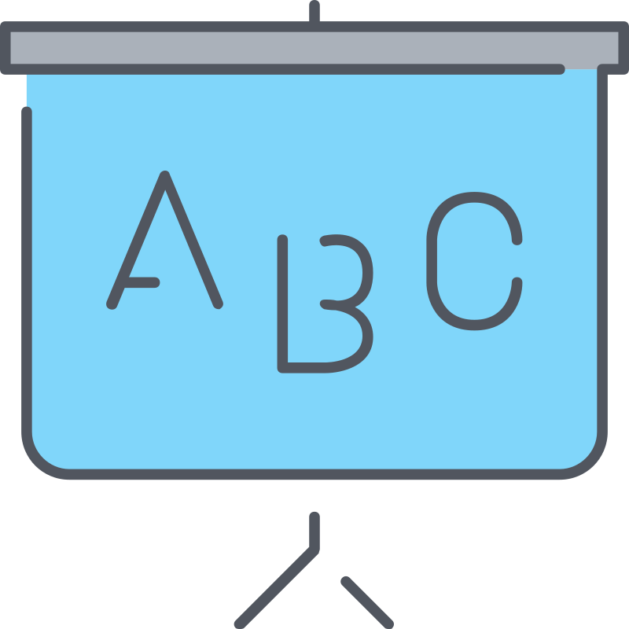

<a name="readme-top"></a>

[![Contributors][contributors-shield]][contributors-url]
[![Forks][forks-shield]][forks-url]
[![Stargazers][stars-shield]][stars-url]
[![Issues][issues-shield]][issues-url]
[![MIT License][license-shield]][license-url]
[![LinkedIn][linkedin-shield]][linkedin-url]

<!-- PROJECT LOGO -->
<br />
<div align="center">
  <a href="https://github.com/JPLACLAU/web3cheatsheet">
    
  </a>

  <h3 align="center">Welcome to my personal web3 starter-pack guide</h3>

  <p align="center">
    An awesome Solidity smart contract cheatsheet to force yourself to create lots of smart contracts weekly!
    <br />
    <a href="https://github.com/JPLACLAU/web3cheatsheet"><strong>Explore the docs »</strong></a>
    <br />
    <br />
    <a href="https://github.com/JPLACLAU/web3cheatsheet">View Demo</a>
    ·
    <a href="https://github.com/JPLACLAU/web3cheatsheet/issues">Report Bug</a>
    ·
    <a href="https://github.com/JPLACLAU/web3cheatsheet/issues">Request Feature</a>
  </p>
</div>

<!-- TABLE OF CONTENTS -->
<details>
  <summary>Table of Contents</summary>
  <ol>
    <li>
      <a href="#about-the-project">About The Project</a>
      <ul>
        <li><a href="#built-with">Built With</a></li>
      </ul>
    </li>
    <li>
      <a href="#getting-started">Getting Started</a>
      <ul>
        <li><a href="#prerequisites">Prerequisites</a></li>
        <li><a href="#installation">Installation</a></li>
      </ul>
    </li>
    <li><a href="#usage">Usage</a></li>
    <li><a href="#roadmap">Roadmap</a></li>
    <li><a href="#changelog">ChangeLog</a></li>
    <li><a href="#contributing">Contributing</a></li>
    <li><a href="#license">License</a></li>
    <li><a href="#contact">Contact</a></li>
    <li><a href="#acknowledgments">Acknowledgments</a></li>  
  </ol>  
</details>  
  
<!-- ABOUT THE PROJECT -->

## About The Project

---

###### _._

  <div align="center">

  <a href="https://github.com/JPLACLAU/web3cheatsheet">  
    

  </a>  
    
  </div>

###### _._

This is my personal ultimate guide and cheatsheet for smart contract creations with solidity, hardhat, & React JS. If you need a starter-pack for creating web3 smart contracts, you should definetly use it!

Here's why:

- Your time is the most important thing in your life. You will save lots of time by following this cheatsheet guide.
- It was carefully planed based on what I have learned in online academies, youtube video courses, bootcamps, and personal experience making lots of mistakes on purpose so you don't have to go through them.
- Using this cheatsheet makes it fun and easy to create Smart Contracts

This project is in an early stage.
Be very careful if you use this code for any purposes, I advise against it.

<p align="right">(<a href="#readme-top">back to top</a>)</p>

### Built With

Built with these frameworks/libraries, add-ons/plugins will be added later

- [![React][react.js]][react-url]
- [![Solidity][soliditylang.org]][soliditylang-url]

<p align="right">(<a href="#readme-top">back to top</a>)</p>

<!-- GETTING STARTED -->

## Getting Started

First things first: Setting up the Environment.

- Everything is done in VST with WSL: Ubuntu.

  ```
  npm+vst+wsl Have to be instalated.
  ```

- Make github repo and clone it from inside vst | wsl: ubuntu.

  ```
  gitclone your empty-just-made github's repo
  ```

- Make the `Readme.md` file and add a `License.txt`

  ```
  Copy one and tune it to the flavour of your smart contract.
  ```

- Open the terminal in vst | Enter WSL: Ubuntu terminal and go to the project's directory.

  ```
  You can get a nice wsl terminal at -link coming soon- & Pimp it.
  ```

- You must have Git, Node, and Yarn. Check it.

  ```
  git --version
  node --version
  yarn --version
  ```

- Initialize the `package.json`.

  ```
  yarn init
  ```

- Add `Hardhat`

  ```
  yarn add --dev hardhat
  ```

- Initialize Hardhat. When asked, answer: | Javascript | .gitignore: `yes` | dependencies: `yes`.

  ```
  yarn hardhat
  ```

- Check Hardhat is runing fine and check its commands

  ```
  yarn hardhat
  ```

- Compile built-in starter contract, just because.

  ```
  yarn hardhat compile
  ```

- In the `/contracts/` folder, create a file `MyAmazingContract.sol`. You can copypaste this template:

<details>
  <summary><i>MyAmazingContract.sol</i></summary>

```
// SPDX-License-Identifier: MIT
// 1. Pragma
pragma solidity ^0.8.checklatestversion;
// 2. Imports
import "./importedfile.sol";  //erase

// 3. Interfaces, Libraries, Contracts

error NameOfTheContract__TheProblem();

/* @title: "A superb Smart Contract"
 * @author: "My Name here"
 * @notice: "Super brief explanation of the contract"
 * @dev: "Super brief technical explanation"
 */

contract NameOfTheContract {
          // Type Declarations
          using importedfile for uint256; //erase

          // State variables
          uint256 public constant MAYUSC_CONSTANT = 1; //erase
          address private immutable i_iForImmutable; //erase
          address[] private s_sForStorageVariable; //erase

          // Events

          // Modifiers

          // Functions Order:
          //// constructor
          //// receive
          //// fallback
          //// external
          //// public
          //// internal
          //// private
          //// view / pure

}

  /*  @param: Explain some param here.
   *  @notice: Write some short ending comentary here. Be nice.
   */

```

<p align="center">For other great Smart Contract templates you can go <a href="https://www.alchemy.com/best/smart-contract-templates">HERE</a></p>

</details>

###### _._

- In the `/scripts/` folder, modify `deploy.js`

<details>
  <summary><i>deploy.js</i></summary>

```
//imports
const { ethers } = require("hardhat");

//async main
async function main() {
  const NameOfTheContractFactory = await ethers.getContractFactory("NameOfTheContract")
  console.log("Deploying contract...")
  const nameOfTheContract = await NameOfTheContractFactory.deploy()
  await nameOfTheContract.deployed()
  console.log(`Deployed contract to: ${nameOfTheContract.address}`)

}

// Error handling
main()
  .then(() => process.exit(0))
  .catch((error) => {
      console.error(error)
      process.exit(1)
  })

```

</details>

###### _._

- Add `Prettier`

  ```
  yarn add --dev prettier prettier-plugin-solidity

  ```

- Create " `.prettierrc` " file in " `./` "

<details>
  <summary><i>.prettierrc</i></summary>

```
{
  "tabWidth": 4,
  "useTabs": false,
  "semi": false,
  "singleQuote": false
}
```

</details>

###### _._

- Create " `.prettierignore` " file in " `./` "

<details>
    <summary><i>.prettierignore</i></summary>
      
```
    node_modules
    package.json
    img
    artifacts
    cache
    coverage
    .env
    .*
    README.md
    coverage.json
```
</details>

###### _._

- Change namings and run the script

  ```
  yarn hardhat run scripts/deploy.js
  ```

  - [Optional] specific network:

    ```
    yarn hardhat run scripts/deploy.js --network hardhat
    ```

- Modify " `hardhat.config.js` " file in " `./` "

<details>
<summary><i>hardhat.config.js</i></summary>

```
require("@nomiclabs/hardhat-waffle")
require("hardhat-gas-reporter")
require("@nomiclabs/hardhat-etherscan")
require("dotenv").config()
require("solidity-coverage")
require("hardhat-deploy")

// You need to export an object to set up your config
// Go to https://hardhat.org/config/ to learn more
// @type import('hardhat/config').HardhatUserConfig

  const COINMARKETCAP_API_KEY = process.env.COINMARKETCAP_API_KEY || ""
  const GOERLI_RPC_URL = process.env.GOERLI_RPC_URL ||
          "https://eth-mainnet.alchemyapi.io/v2/your-api-key"
  const PRIVATE_KEY = process.env.PRIVATE_KEY || "0x"
  const ETHERSCAN_API_KEY = process.env.ETHERSCAN_API_KEY || ""

  module.exports = {
      defaultNetwork: "hardhat",
      networks: {
        hardhat: {
          chainId: 31337,
        // gasPrice: 130000000000,
      },
        goerli: {
          url: GOERLI_RPC_URL,
          accounts: [PRIVATE_KEY],
          chainId: 5,
          blockConfirmations: 6,
      },
  },
      solidity: {
        compilers: [
          {
              version: "^0.8.17",
          },
          {
              version: "0.6.6",
          },
      ],
  },
      etherscan: {
        apiKey: ETHERSCAN_API_KEY,
        // customChains: [], // uncomment this line if you are getting a TypeError: customChains is not iterable
  },
      gasReporter: {
        enabled: true,
        currency: "USD",
        outputFile: "gas-report.txt",
        noColors: true,
      // coinmarketcap: COINMARKETCAP_API_KEY,
  },
      namedAccounts: {
        deployer: {
          default: 0, // here this will by default take the first account as deployer
          1: 0, // similarly on mainnet it will take the first account as deployer. Note though that depending on how hardhat network are configured, the account 0 on one network can be different than on another
      },
  },
      mocha: {
        timeout: 500000,
  },
  }

```

</details>

###### _._

- Add " `.env` " file in " `./` ". Make sure it is on `.gitignore` before saving any changes.

<details>
<summary><i>.env</i></summary>

```
PRIVATE_KEY=234523425asdfasdfa
GOERLI_RPC_URL=http://0.0.0.0:8545
COINMARKETCAP_API_KEY=asdfasdfasdfasdfasdfasdfasdf
ETHERSCAN_API_KEY=asdfasdfasdfs
```

- [Important] : If you don't have those keys go check Lessons 3-6 of <a href="https://github.com/PatrickAlphaC">Patrick Collin</a>'s <a href="https://www.freecodecamp.org/">freeCodeCamp</a> 32h Solidity course <a href="https://youtu.be/gyMwXuJrbJQ">HERE</a>

</details>

###### _._

- Run hardhat node environment (You can pick a pKey from here).

  ```
  yarn hardhat node
  ```

- Run hardhat local network

  ```
  yarn hardhat console --network localhost
  ```

- Clean hardhat cache

  ```
  yarn hardhat clean
  ```

- Add `dotenv`

  ```
  yarn add --dev dotenv
  ```

- Add `hardhat-etherscan`

  ```
  yarn add --save-dev @nomiclabs/hardhat-etherscan
  ```

- Add `hardhat-gas-reporter`

  ```
  yarn add hardhat-gas-reporter --dev
  ```

- Add `hardhat-deploy-ethers ethers`

  ```
  yarn add --dev @nomiclabs/hardhat-ethers@npm:hardhat-deploy-ethers ethers
  ```

- Add `Chainlink contracts`

  ```
  yarn add --dev @chainlink/contracts
  ```

- Add `hardhat-deploy`. Also delete `deploy.js` from `/scripts/` and make its replacement in `/deploy/` with `01-deploy-contractname`.

  ```
  yarn add hardhat-deploy --dev
  rm scripts/deploy.js
  mkdir deploy
  touch deploy/01-deploy-myamazingcontract.js
  touch helper-hardhat-config.js
  touch deploy/00-deploy-mocks.js
  ```

<details>
    <summary><i>01-deploy-myamazingcontract.js</i></summary>

```
const { network } = require("hardhat")
const { networkConfig, developmentChains } = require("../helper-hardhat-config")
const { verify } = require("../utils/verify")
require("dotenv").config()

module.exports = async ({ getNamedAccounts, deployments }) => {
    const { deploy, log } = deployments
    const { deployer } = await getNamedAccounts()
    const chainId = network.config.chainId

    let ethUsdPriceFeedAddress
    if (chainId == 31337) {
        const ethUsdAggregator = await deployments.get("MockV3Aggregator")
        ethUsdPriceFeedAddress = ethUsdAggregator.address
    } else {
        ethUsdPriceFeedAddress = networkConfig[chainId]["ethUsdPriceFeed"]
    }
    log("----------------------------------------------------")
    log("Deploying MyAmazingContract and waiting for confirmations...")
    const myAmazingContract = await deploy("MyAmazingContract", {
        from: deployer,
        args: [ethUsdPriceFeedAddress],
        log: true,
        // we need to wait if on a live network so we can verify properly
        waitConfirmations: network.config.blockConfirmations || 1,
    })
    log(`MyAmazingContract deployed at ${myAmazingContract.address}`)

    if (
        !developmentChains.includes(network.name) &&
        process.env.ETHERSCAN_API_KEY
    ) {
        await verify(myAmazingContract.address, [ethUsdPriceFeedAddress])
    }
}

module.exports.tags = ["all", "myAmazingContract"]
```

</details>

###### _._

<details>
  <summary><i>helper-hardhat-config.js</i></summary>

```
const networkConfig = {
    31337: {
        name: "localhost",
    },
    // Price Feed Address, values can be obtained at https://docs.chain.link/docs/reference-contracts
    5: {
        name: "goerli",
        ethUsdPriceFeed: "0xD4a33860578De61DBAbDc8BFdb98FD742fA7028e",
    },
}

const developmentChains = ["hardhat", "localhost"]

module.exports = {
    networkConfig,
    developmentChains,
}
```

</details>

###### _._

<details>
  <summary><i>00-deploy-mocks.js</i></summary>

```
const { network } = require("hardhat")

const DECIMALS = "8"
const INITIAL_PRICE = "200000000000" // 2000
module.exports = async ({ getNamedAccounts, deployments }) => {
    const { deploy, log } = deployments
    const { deployer } = await getNamedAccounts()
    const chainId = network.config.chainId
    // If we are on a local development network, we need to deploy mocks!
    if (chainId == 31337) {
        log("Local network detected! Deploying mocks...")
        await deploy("MockV3Aggregator", {
            contract: "MockV3Aggregator",
            from: deployer,
            log: true,
            args: [DECIMALS, INITIAL_PRICE],
        })
        log("Mocks Deployed!")
        log("------------------------------------------------")
        log(
            "You are deploying to a local network, you'll need a local network running to interact"
        )
        log(
            "Please run `npx hardhat console` to interact with the deployed smart contracts!"
        )
        log("------------------------------------------------")
    }
}
module.exports.tags = ["all", "mocks"]
```

</details>

###### _._

- In the `/contracts/test/` folder, create a file `test-deploy.js`.

```
mkdir contracts/test
touch contracts/test/MockV3Aggregator.sol

```

<details>
  <summary><i>MockV3Aggregator.sol</i></summary>

```
// SPDX-License-Identifier: MIT
pragma solidity ^0.6.0;

import "@chainlink/contracts/src/v0.6/tests/MockV3Aggregator.sol";
```

</details>

###### _._

---

### Let's continue with adding more testing tools

###### _._

- Add `solhint`. Check Solidity writing errors.

  ```
  yarn add solhint
  yarn solhint contracts/*.sol
  ```

- Add `solidity-coverage`. Great for starting to test.

  ```
  yarn add --dev solidity-coverage
  yarn hardhat coverage
  ```

- In the `/test/` folder, create a file `test-deploy.js`.

<details>
  <summary><i>test-deploy.js</i></summary>

```
y
```

</details>

###### _._

- Run tests

  ```
  yarn hardhat test
  ```

  - [Optional] specific network:

    ```
    yarn hardhat test --grep keywordOfTheTest
    ```

- Desc: " `blaba` "

  ```
  code
  ```

- Desc: " `blaba` "

  ```
  code
  ```

- Desc: " `blaba` "

  ```
  code
  ```

### Prerequisites

There will be a list of things you need to use this amazing Smart Contract.

- npm

  ```
  npm nothing here yet
  ```

### Installation

_Example on how to install/use will come in the future..._

1. Goto [https://github.com/JPLACLAU/web3cheatsheet](https://github.com/JPLACLAU/web3cheatsheet)
2. Clone the repo

   ```
   git clone https://github.com/JPLACLAU/web3cheatsheet
   ```

3. Coming soon...
   ```
   Coming soon...
   ```

<p align="right">(<a href="#readme-top">back to top</a>)</p>

<!-- USAGE EXAMPLES -->

## Usage

You should not use this guide at this moment.

_For more examples, please refer to the [Documentation](https://github.com/JPLACLAU/web3cheatsheet)_

<p align="right">(<a href="#readme-top">back to top</a>)</p>

<!-- ROADMAP -->

## Roadmap

- [x] Start the proyect
- [ ] Add moar stuff

See the [open issues](https://github.com/JPLACLAU/web3cheatsheet/issues) for a full list of proposed features (and known issues).

<p align="right">(<a href="#readme-top">back to top</a>)</p>

<!-- CHANGELOG -->

## ChangeLog

Current version: `0.1`

| Version | Changes                                                       |
| ------- | ------------------------------------------------------------- |
| `0.2`   | Real usefull cheatsheet guide...at least some sections of it. |
| `0.1`   | Start the proyect /write the Readme.md                        |

<p align="right">(<a href="#readme-top">back to top</a>)</p>

<!-- CONTRIBUTING -->

## Contributing

Contributions are what make the open source community such an amazing place to learn, inspire, and create. Any contributions you make are **greatly appreciated**.

If you have a suggestion that would make this better, please fork the repo and create a pull request. You can also simply open an issue with the tag "enhancement".
Don't forget to give the project a star! Thanks again!

1. Fork the Project
2. Create your Feature Branch (`git checkout -b feature/AmazingFeature`)
3. Commit your Changes (`git commit -m 'Add some AmazingFeature'`)
4. Push to the Branch (`git push origin feature/AmazingFeature`)
5. Open a Pull Request

<p align="right">(<a href="#readme-top">back to top</a>)</p>

<!-- LICENSE -->

## License

Distributed under the MIT License. See `LICENSE.txt` for more information.

<p align="right">(<a href="#readme-top">back to top</a>)</p>

<!-- CONTACT -->

## Contact

Jean-Paul Laclau - [@jplaclau](https://www.linkedin.com/in/jplaclau/) -

Project Link: [https://github.com/JPLACLAU/web3cheatsheet](https://github.com/JPLACLAU/web3cheatsheet)

<p align="right">(<a href="#readme-top">back to top</a>)</p>

<!-- ACKNOWLEDGMENTS -->

## Acknowledgments

Thank you so much to.. no one yet! Be the first to collab!

- [No one yet](https://no-one.com)

<p align="right">(<a href="#readme-top">back to top</a>)</p>

## Disclaimer

Check the `LICENSE.txt`

<!-- MARKDOWN LINKS & IMAGES -->
<!-- Thank you so much Othneildrew for this amazing Readme template -->
<!-- https://github.com/JPLACLAU/web3cheatsheet/blob/master/README.md -->
<!-- https://www.markdownguide.org/basic-syntax/#reference-style-links -->

[contributors-shield]: https://img.shields.io/github/contributors/JPLACLAU/Best-README-Template.svg?style=for-the-badge
[contributors-url]: https://github.com/JPLACLAU/web3cheatsheet/graphs/contributors
[forks-shield]: https://img.shields.io/github/forks/JPLACLAU/Best-README-Template.svg?style=for-the-badge
[forks-url]: https://github.com/JPLACLAU/web3cheatsheet/network/members
[stars-shield]: https://img.shields.io/github/stars/JPLACLAU/Best-README-Template.svg?style=for-the-badge
[stars-url]: https://github.com/JPLACLAU/web3cheatsheet/stargazers
[issues-shield]: https://img.shields.io/github/issues/JPLACLAU/Best-README-Template.svg?style=for-the-badge
[issues-url]: https://github.com/JPLACLAU/web3cheatsheet/issues
[license-shield]: https://img.shields.io/github/license/JPLACLAU/Best-README-Template.svg?style=for-the-badge
[license-url]: https://github.com/JPLACLAU/web3cheatsheet/blob/master/LICENSE.txt
[linkedin-shield]: https://img.shields.io/badge/-LinkedIn-black.svg?style=for-the-badge&logo=linkedin&colorB=555
[linkedin-url]: https://linkedin.com/in/jplaclau
[product-screenshot]: images/screenshot.png
[next.js]: https://img.shields.io/badge/next.js-000000?style=for-the-badge&logo=nextdotjs&logoColor=white
[next-url]: https://nextjs.org/
[react.js]: https://img.shields.io/badge/React-20232A?style=for-the-badge&logo=react&logoColor=61DAFB
[react-url]: https://reactjs.org/
[vue.js]: https://img.shields.io/badge/Vue.js-35495E?style=for-the-badge&logo=vuedotjs&logoColor=4FC08D
[vue-url]: https://vuejs.org/
[angular.io]: https://img.shields.io/badge/Angular-DD0031?style=for-the-badge&logo=angular&logoColor=white
[angular-url]: https://angular.io/
[svelte.dev]: https://img.shields.io/badge/Svelte-4A4A55?style=for-the-badge&logo=svelte&logoColor=FF3E00
[svelte-url]: https://svelte.dev/
[laravel.com]: https://img.shields.io/badge/Laravel-FF2D20?style=for-the-badge&logo=laravel&logoColor=white
[laravel-url]: https://laravel.com
[bootstrap.com]: https://img.shields.io/badge/Bootstrap-563D7C?style=for-the-badge&logo=bootstrap&logoColor=white
[bootstrap-url]: https://getbootstrap.com
[jquery.com]: https://img.shields.io/badge/jQuery-0769AD?style=for-the-badge&logo=jquery&logoColor=white
[jquery-url]: https://jquery.com
[soliditylang.org]: https://img.shields.io/badge/Solidity-0769AD?style=for-the-badge&logo=Solidity&logoColor=white
[soliditylang-url]: https://soliditylang.org
